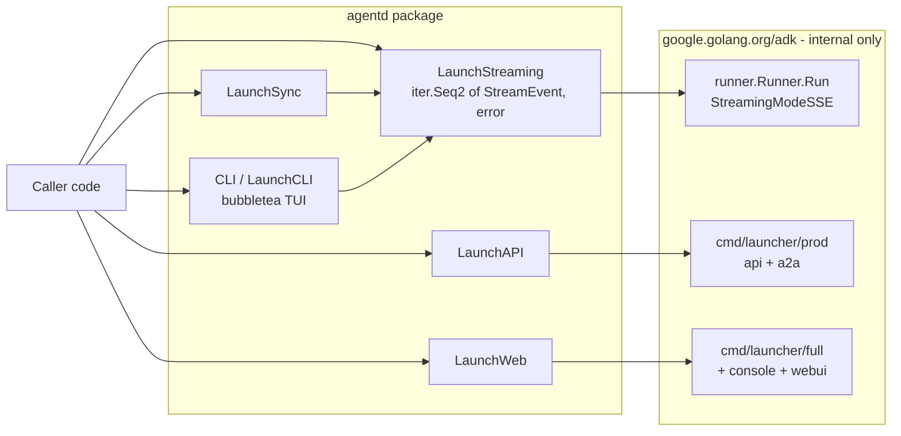

# agentd

A friendly Go wrapper around [google.golang.org/adk](https://pkg.go.dev/google.golang.org/adk).

This document is the **north-star spec** for `agentd`: it describes the ideal
shape of the public API. Some pieces already exist in the repo, others are
still TODO (see [Known gaps](#known-gaps)). When in doubt, this file wins —
the implementation should evolve to match it.

## Philosophy

> Users import **one** module — `github.com/apzuk3/agentd` — and never have
> to touch `google.golang.org/adk/...` directly.

Google's ADK is powerful but spread across a dozen sub-packages (`agent`,
`agent/llmagent`, `agent/workflowagents/loopagent`, `tool`,
`tool/functiontool`, `runner`, `session`, `cmd/launcher/*`, `model/gemini`,
`genai`, …). Asking application code to import all of those is noisy and
couples every consumer to ADK's internal layout.

`agentd` is the single import surface. Internally it re-exposes the ADK
primitives through small, focused, **option-func** constructors:

```go
import "github.com/apzuk3/agentd"

model, _ := agentd.NewModel(ctx, agentd.ModelGeminiFlash35)

agentd.AddTool("app.deploy", "Deploys the app", deploy)

root, _ := agentd.LLMAgent("executor", model,
    agentd.WithLLMAgentTools("app.deploy"),
    agentd.WithLLMAgentInstruction("Deploy when asked."),
)

agentd.CLI(root)
```

That is the whole import list. No `adk/...`, no `genai`, no `session`.

The rest of this document codifies the rules that keep it that way.

## Tools

Tools are registered into a **global registry** and referenced by name when
constructing an agent. The handler is a regular generic Go function — its
`TArgs` / `TResults` types drive the JSON schema the model sees.

```go
type DeployInput struct {
    Environment string `json:"environment" jsonschema_description:"Target env"`
    Ref         string `json:"ref"         jsonschema_description:"Git ref to deploy"`
}
type DeployOutput struct {
    URL string `json:"url" jsonschema_description:"Deployed app URL"`
}

agentd.AddTool("app.deploy", "Deploys the current app to production",
    func(_ tool.Context, in DeployInput) (DeployOutput, error) {
        return DeployOutput{URL: "https://example.com"}, nil
    },
)
```

Reference by name when building an agent:

```go
agentd.LLMAgent("executor", model, agentd.WithLLMAgentTools("app.deploy"))
```

### Tool options

All defined in [`tools.go`](tools.go). The current set:

| Option                                           | Purpose                                                                                                       |
| ------------------------------------------------ | ------------------------------------------------------------------------------------------------------------- |
| `WithFunctionToolInputSchema(*jsonschema.Schema)`  | Override the auto-inferred input schema (add enums, formats, descriptions, defaults, required fields).        |
| `WithFunctionToolOutputSchema(*jsonschema.Schema)` | Override the auto-inferred output schema so the model knows the response shape on the next turn.              |
| `WithFunctionToolIsLongRunning(bool)`              | Mark async/pending tools (deploys, transcodes, human approvals). Stops the model from spamming duplicate calls. |
| `WithFunctionToolRequireConfirmation(bool)`        | Static Human-in-the-Loop gate — every call asks for approval before the handler runs.                         |
| `WithFunctionToolRequireConfirmationProvider[T]`   | Dynamic HITL gate — predicate over decoded args decides whether this specific call needs approval.            |

The HITL flow is documented in detail in the godoc block in
[`tools.go`](tools.go); the two confirmation options hide ADK's
`ctx.RequestConfirmation` / `ctx.ToolConfirmation` bookkeeping behind a single
flag.

### Custom registries

`agentd.AddTool` writes into the package-global `defaultToolRegistry`. For
tests or multi-tenant servers, use `agentd.NewToolRegistry()` and (future)
constructors that accept a registry explicitly. The global registry stays the
default to keep the simple case one-liner.

### Built-in tools

Some tools are provided by `agentd` itself and registered automatically on
import (no `AddTool` call required). Reference them the same way as your own
tools:

```go
agentd.LLMAgent("researcher", model,
    agentd.WithLLMAgentTools(agentd.BuiltinTavily),
)
```

Currently provided:

- `BuiltinTavily` (string value `"builtin:tavily"`) — web / real-time search
  backed by the Tavily API.

Configure built-in tools (most importantly their credentials) with the
corresponding `Configure*` function **before** you build agents that use them:

```go
agentd.ConfigureBuiltinTavily(
    agentd.WithTavilyAPIKey("tvly-..."), // or rely on TAVILY_API_KEY env
)
```

See the godoc on `BuiltinTavily` and `ConfigureBuiltinTavily` for details.

## Agents

Four agent kinds, each with its own constructor. All return
`google.golang.org/adk/agent.Agent` (the only ADK type leaking through today;
candidate for wrapping in a future `agentd.Agent` alias).

### 1. LLM agent — [`agent_llm.go`](agent_llm.go)

The workhorse. Drives a model, optionally with tools.

```go
agent, err := agentd.LLMAgent("executor", model,
    agentd.WithLLMAgentDescription("Deploys apps."),
    agentd.WithLLMAgentInstruction("Only answer deploy questions."),
    agentd.WithLLMAgentTools("app.deploy", "app.rollback"),
)
```

Options: `WithLLMAgentDescription`, `WithLLMAgentInstruction`,
`WithLLMAgentTools(names...)`, `WithLLMAgentModel(Model)` (see TODO below).

### 2. Loop agent — [`agent_loop.go`](agent_loop.go)

Re-runs a child agent up to N times.

```go
loop, _ := agentd.LoopAgent("refine",
    agentd.WithLoopAgentMaxIterations(5),
)
```

### 3. Parallel agent — [`agent_parallel.go`](agent_parallel.go)

Fans out to children concurrently and joins their output.

```go
fanout, _ := agentd.ParallelAgent(searchAgent, summariseAgent)
```

### 4. Sequential agent — [`agent_sequential.go`](agent_sequential.go)

Pipes child agents one after the other.

```go
pipeline, _ := agentd.SequentialAgent(planner, executor, reviewer)
```

## Models

```go
model, err := agentd.NewModel(ctx, agentd.ModelClaudeSonnet46,
    agentd.WithModelAPIKey("sk-..."),      // or rely on env
    agentd.WithModelAPIKeyEnv("MY_KEY"),   // extra env names to try first
    agentd.WithModelHTTPClient(myClient),  // custom transport
)
```

Source of truth: [`model.go`](model.go).

Supported `Model` constants (also in [`agent_llm.go`](agent_llm.go)):

- **Anthropic** — `ModelClaudeOpus48`, `ModelClaudeOpus47`,
  `ModelClaudeSonnet46`, `ModelClaudeSonnet45`, `ModelClaudeHaiku45`.
- **OpenAI** — `ModelOpenAIGPT55`, `ModelOpenAIGPT55Pro`,
  `ModelOpenAIGPT55Mini`, `ModelOpenAIGPT55Nano`, `ModelOpenAIGPT54`,
  `ModelOpenAIGPT54Mini`, `ModelOpenAIGPT54Nano`.
- **Gemini** — `ModelGeminiFlash35`, `ModelGeminiPro31`,
  `ModelGeminiFlashLite31`, `ModelGeminiFlash3`, `ModelGeminiPro25`.

`Model.Provider()` returns the `ModelProvider` for routing. API keys are
resolved from `WithModelAPIKey` first, then the env vars passed to
`WithModelAPIKeyEnv`, then a provider-default list
(`ANTHROPIC_API_KEY` / `OPENAI_API_KEY` / `GOOGLE_API_KEY`, plus common
aliases — see `defaultEnvVars` in [`model.go`](model.go)).

## Launchers

Launchers are the **runtime** layer — they take an agent and put it in front
of a user (CLI), an HTTP API, a web UI, or another program (Sync). The
philosophy here is the same as everywhere else: callers never import ADK
launcher packages or wire up `runner.Runner` / `session.Service` themselves.

All non-CLI launchers compose around a single primitive: `LaunchStreaming`.



### `LaunchStreaming` — the core primitive

```go
// StreamEvent is agentd's stable, ADK-free view of an agent turn.
// Callers range over LaunchStreaming and switch on event.Kind.
type StreamEventKind int

const (
    StreamEventText StreamEventKind = iota // incremental model text
    StreamEventThought                     // model "thinking" delta
    StreamEventToolCall                    // model invoked a tool
    StreamEventToolResult                  // tool returned a value
    StreamEventFinal                       // final aggregated reply
    StreamEventError                       // non-fatal error (also surfaces as iter error)
)

type StreamEvent struct {
    Kind     StreamEventKind
    Text     string         // for Text / Thought / Final
    ToolName string         // for ToolCall / ToolResult
    ToolArgs map[string]any // for ToolCall
    ToolData any            // for ToolResult
    Partial  bool           // true while a streamed message is still being built
}

func LaunchStreaming(
    ctx context.Context,
    agent agent.Agent,
    input string,
    opts ...RunOption,
) iter.Seq2[*StreamEvent, error]
```

`RunOption` is the single, neutral option set shared by every launcher
(`LaunchStreaming`, `LaunchSync`, `CLI`) — none of these settings are specific
to streaming, so they carry no `Streaming` prefix:

- `WithUserID(string)` — defaults to `"agentd-user"`.
- `WithSessionID(string)` — defaults to a fresh UUID.
- `WithAppName(string)` — defaults to `"agentd"`.

The session store is always in-memory for streaming; there is no public option
that takes an ADK service type (see [Services](#services)). There is also
deliberately no public streaming-mode option: `LaunchStreaming` always streams
(SSE), `LaunchSync` always drains without streaming (None).

Internally it builds a `runner.Runner` with `AutoCreateSession: true`, calls
`runner.Run` with `agent.RunConfig{StreamingMode: agent.StreamingModeSSE}`,
and maps each `*session.Event` to a `*StreamEvent` via the shared `mapEvent`
helper.

Range usage is idiomatic Go 1.23+:

```go
for ev, err := range agentd.LaunchStreaming(ctx, root, "deploy main to prod") {
    if err != nil { return err }
    switch ev.Kind {
    case agentd.StreamEventText:    fmt.Print(ev.Text)
    case agentd.StreamEventToolCall: fmt.Printf("\n[tool %s]\n", ev.ToolName)
    }
}
```

### `LaunchSync` — fire-and-forget, returns the final answer

```go
func LaunchSync(
    ctx context.Context,
    agent agent.Agent,
    input string,
    opts ...RunOption,
) (string, error)
```

Implementation: range over the shared `stream` engine in non-streaming mode,
accumulate `StreamEventFinal` text, return the result. One screenful of code;
no extra surface area for callers to learn.

### `CLI` / `LaunchCLI` — rich terminal chat

`agentd.CLI(rootAgent, subAgents...)` already exists today (the bubbletea TUI
in [`cli.go`](cli.go)). The north-star refactor:

1. Drop the private `runAgent` / `readStream` helpers in [`cli.go`](cli.go).
2. Drive the TUI from `LaunchStreaming` instead, so the CLI is just a
   bubbletea front end that consumes `StreamEvent`s.
3. Keep the public signature `agentd.CLI(rootAgent, subAgents ...agent.Agent)`
   and add `LaunchCLI` as an alias for naming symmetry with the other
   launchers.

That collapses ~150 lines of session/runner bookkeeping in [`cli.go`](cli.go)
to a single `for ev, err := range agentd.LaunchStreaming(...)` loop and
guarantees the CLI's behaviour matches everything else.

### `LaunchAPI` — REST + A2A server (thin proxy)

Wraps ADK's [`cmd/launcher/prod.NewLauncher()`][prod] (universal launcher
holding `web` ← `api` + `a2a`). It blocks until SIGINT (Ctrl+C) or a supplied
context is cancelled.

```go
func LaunchAPI(root agent.Agent, opts ...ServerOption) error
```

Both server launchers share one `ServerOption` set (none take an ADK service
type — see [Services](#services)):

- `WithSubAgents(...agent.Agent)` — exposes root + sub-agents via a multi loader.
- `WithInMemorySessionService()` — session store (also the default).
- `WithInMemoryArtifactService()` — artifact store (also the default).
- `WithInMemoryMemoryService()` — long-term memory (opt-in).
- `WithServerArgs(...string)` — replaces the default ADK launcher args (must
  include sublauncher keywords, e.g. `"-port=9090", "api"`).
- `WithServerContext(context.Context)` — own the lifecycle instead of the
  default SIGINT handling.

Zero-config works because session and artifact default to in-memory:

```go
if err := agentd.LaunchAPI(root); err != nil { log.Fatal(err) }
```

Internally it builds the loader and `launcher.Config` and calls
`prod.NewLauncher().Execute(ctx, cfg, []string{"api"})` (defaults to `:8080`,
path prefix `/api`).

### `LaunchWeb` — REST + A2A + ADK Web UI

Same `ServerOption` set as `LaunchAPI`, built on
[`cmd/launcher/full.NewLauncher()`][full] so the embedded ADK Web UI ships too
(UI at `/ui`, API at `/api` on `:8080`). Use for local dev / demos.

```go
func LaunchWeb(root agent.Agent, opts ...ServerOption) error
```

### Services

Callers never name or construct an ADK service. There are no public service
objects, aliases, or constructors and no `WithXService(svc)` options. Service
selection is expressed with concise, parameterless named options
(`WithInMemorySessionService` / `WithInMemoryArtifactService` /
`WithInMemoryMemoryService`), and the common services default to in-memory so
zero-config works. The ADK service types appear only inside agentd as
unexported struct fields. Custom/shared/persistent backends are a future
addition (see [Known gaps](#known-gaps)) and will be added as more named
options, never by re-exposing ADK types.

[prod]: https://pkg.go.dev/google.golang.org/adk/cmd/launcher/prod
[full]: https://pkg.go.dev/google.golang.org/adk/cmd/launcher/full

### Putting it together

```go
func main() {
    agentd.AddTool("app.deploy", "Deploy to prod", deploy)

    model, err := agentd.NewModel(context.Background(), agentd.ModelGeminiFlash35)
    if err != nil { log.Fatal(err) }

    root, err := agentd.LLMAgent("executor", model,
        agentd.WithLLMAgentTools("app.deploy"),
        agentd.WithLLMAgentInstruction("Deploy when asked."),
    )
    if err != nil { log.Fatal(err) }

    switch os.Getenv("MODE") {
    case "api": _ = agentd.LaunchAPI(root)
    case "web": _ = agentd.LaunchWeb(root)
    case "sync":
        out, _ := agentd.LaunchSync(context.Background(), root, "deploy main")
        fmt.Println(out)
    default:
        agentd.CLI(root)
    }
}
```

## Conventions for contributors (and AI agents)

These rules keep the wrapper thin and the public surface honest.

1. **One import for callers.** Anything under `google.golang.org/adk/...` or
   `google.golang.org/genai` must stay inside the `agentd` package. If a
   caller needs an ADK type, expose an `agentd.*` equivalent first.
2. **Option-func pattern everywhere.** New constructors take `(required...,
   ...XxxOption)` where `XxxOption = func(*xxxConfig) error`. Mirror the
   names already in the repo: `WithLLMAgent…`, `WithFunctionTool…`,
   `WithModel…`, the neutral launcher `RunOption` set (`WithUserID`,
   `WithSessionID`, `WithAppName`), and the `ServerOption` set. Don't name
   options after a transport detail (no `WithStreamingMode`-style knobs).
3. **No ADK service types in public options.** Public options never name or
   take `session.Service` / `artifact.Service` / `memory.Service` (or any ADK
   type). Express service selection with named parameterless options
   (`WithInMemoryArtifactService()`), default the common ones to in-memory, and
   keep the ADK service value as an unexported config field.
4. **Tools are referenced by name.** Don't accept `tool.Tool` arguments in
   public APIs — look them up from the registry. Keeps callers off the ADK
   `tool` package.
5. **One streaming primitive.** New launchers that show output must consume
   `LaunchStreaming`; don't open a second path into `runner.Runner.Run`.
6. **Godoc + runnable example for every exported symbol.** The existing
   `WithFunctionTool*` options in [`tools.go`](tools.go) are the bar.
7. **`go build ./...` after every change.** The repo currently builds clean;
   keep it that way.
8. **Single global default, explicit overrides.** `defaultToolRegistry`,
   `defaultEnvVars`, and the implicit in-memory session service are
   deliberate defaults — never remove them, but always allow overriding via
   an option.

## Known gaps

Things this doc describes that aren't implemented (or are stubs) today:

- `WithLLMAgentModel` in [`agent_llm.go`](agent_llm.go) is a no-op — the
  model is currently only set via the `LLMAgent(name, model, ...)` second
  positional arg. Either implement it or remove it.
- `agentd.ParallelAgent` / `agentd.SequentialAgent` in
  [`agent_parallel.go`](agent_parallel.go) /
  [`agent_sequential.go`](agent_sequential.go) accept `agents...` but
  silently drop them and hardcode `Name: "parallel"` / `"sequential"`. Need
  to plumb sub-agents and accept a name.
- `LaunchStreaming` / `LaunchSync` (see [`launch_streaming.go`](launch_streaming.go)
  / [`launch_sync.go`](launch_sync.go)) and `LaunchAPI` / `LaunchWeb` (see
  [`launch_server.go`](launch_server.go)) are implemented. Still TODO:
  `LaunchCLI`, and refactoring the existing `CLI` in [`cli.go`](cli.go) to
  consume `LaunchStreaming` instead of its inlined `runAgent` / `readStream`.
- Only in-memory services are exposed. Custom/shared/persistent session,
  artifact, and memory backends are not yet expressible; when added they must
  come as more named options (e.g. `WithSQLiteSessionService(path)`) or a
  non-leaking builder, never by re-exposing ADK service types.
- `agentd.Agent` alias for `google.golang.org/adk/agent.Agent` would close
  the last public-API leak; today every constructor returns the ADK type.
